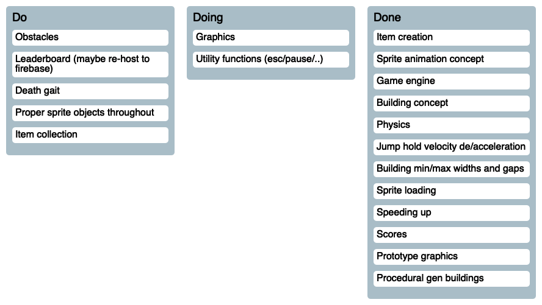

# Gargoyle Rooftop Runner

# [Check it out!](https://entozoon.github.io/gargoyle-runner/)

## Develop

    npm i
    npm start

## Deploy

    npm run deploy
    (push to master as normal)

<!---KANBAN
# Do
- Sprite animation
- Obstacles
- Leaderboard (maybe re-host to firebase)

# Doing
- Graphics
- Physics
- Jump hold velocity acceleration

# Done
- Game engine
- Building concept
- Sprite loading
- Speeding up
- Scores
- Prototype graphics
- Procedural gen buildings
KANBAN--->

## Future Ideas

* Free running mode - run left and right, as fast as you like after a crazy
  boost. Why not? I've built it with legit velocities..
* Power ups in general
* Kill teh enemiez, Mario style?
